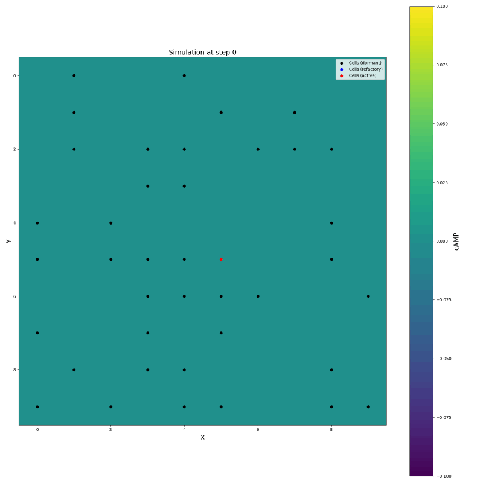

# Sanity checking PDE

Here I'm testing the diffusion equation without cells under different setups.

## Diffusion equation without cells (only central beacon)

## Diffusion equation without cells (only central beacon) and without decay

## Diffusion equation without cells (only central beacon), beacon behaves like a cell (has refactory period, etc, but it always gets excited when the time is up)

##  Diffusion equation with cells (only central beacon), beacon behaves like a cell (has refactory period, etc, but it always gets excited when the time is up)

## Diffusion equation with alywas on beacon and with cells

## Diffusion equation with alywas on beacon and with cells and 1/2 timestep

## Conclusions

- the chess-board-pattern is caused by the decay, it has a pulse-like behavior: on-off-on-off
    - and this is caused by the too large timestep
- the cells' shift to the right is because
    - of the pulsing effect, maybe cells should only updated at steps shitfter by an odd
    number compared to the PDE
        - no, let's get back to the same time sync
    - of the bad indexing of numpy array
        - now fixed.
