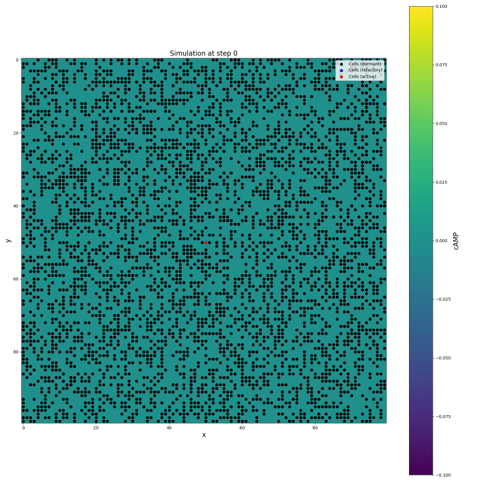
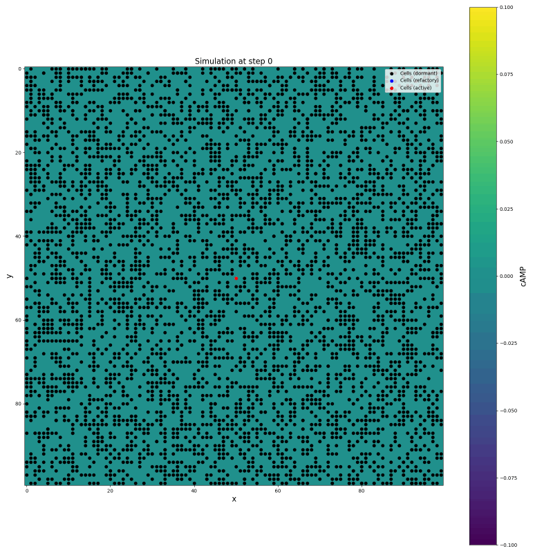
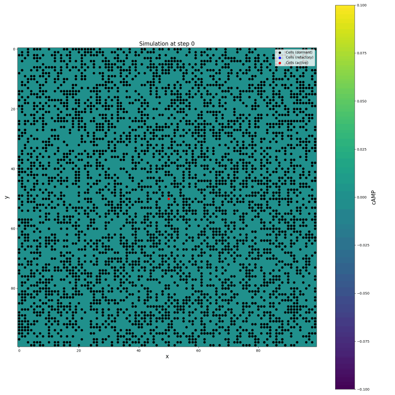
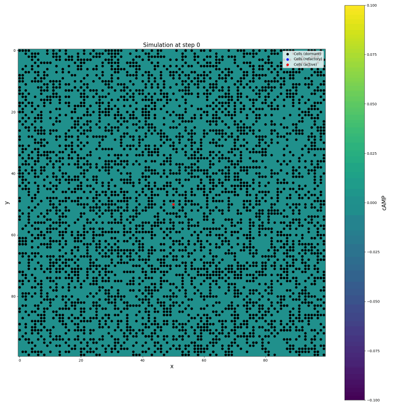
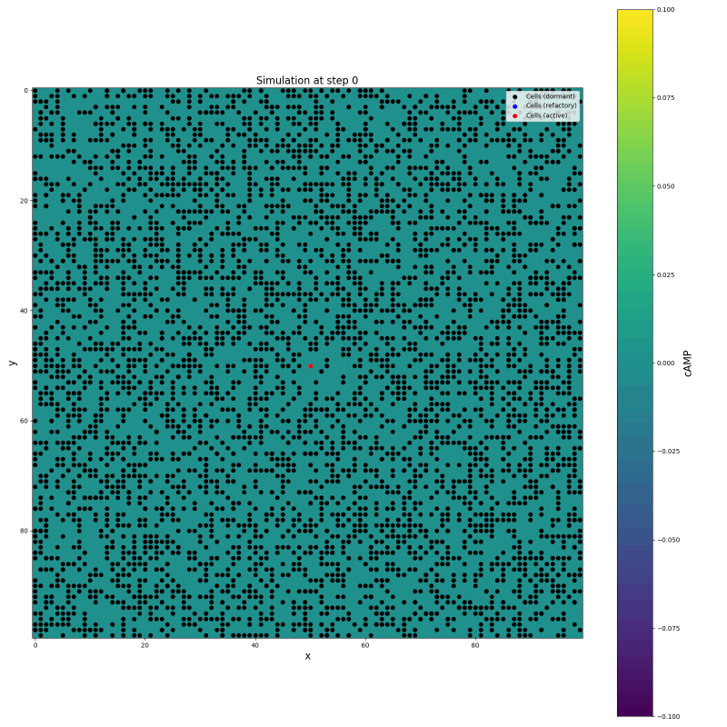
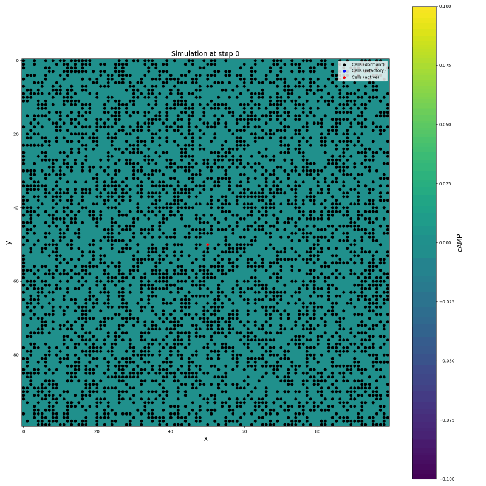
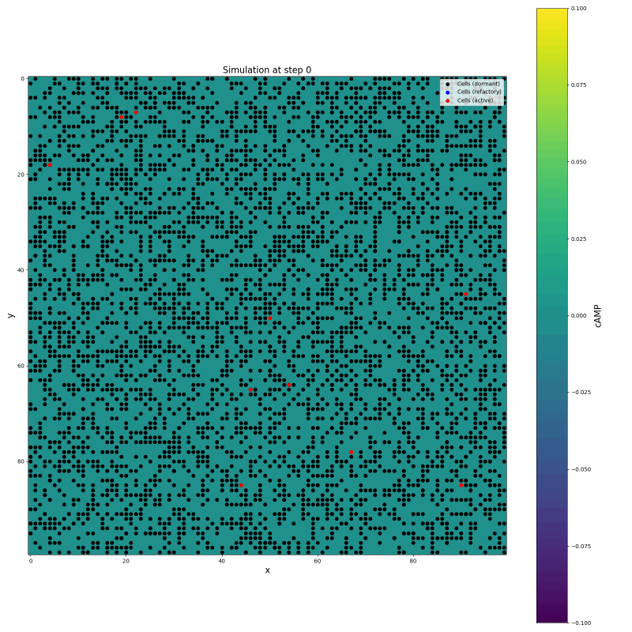

# Simulations

## Simulation0 

Let's have export at each timestep to debug the system.

## Simulation1

Because of multiple bugs the cells always move in the direction of the last neighbour coordinate (bottom right) checked. Also the threshold for difference was below then numerical noise, so cells with 0 concentration neighbours also moved. Thus the source got separated from the rest of the system.

## Simulation with increased threshold for difference

Now the concentration difference has to be larger than 0.1 so that the cell moves.

## Simulation2 

Still bug in movement, but a periodic, spherical wave of excitation is observable from the center.

## Simulation3

If movement is fixed, still the area is cleared out, and cells move bottom right.

## Simulation4 

Still area gets cleared, cells merge.

## Simulation5, 6, 7, 8

Bugs fixed, experimenting with delaying the move step of the cell, so that it only moves after 4 timesteps.

## Simulation9 

Better, but no stationary pattern reached, still a bottom right preference of directionality.

## Simulation10 

Some trials, still not good.

## Simulation11, 12

Other parameters, not good.

## Simulation13, 14

More sources? The tree-branch-like pattern doesn't emerge

## Solution

So, if one reads the article, it turns out that:
- cells only move ones per activation
- cells are not allowed to overlap

So my assumptions were wrong until now.

